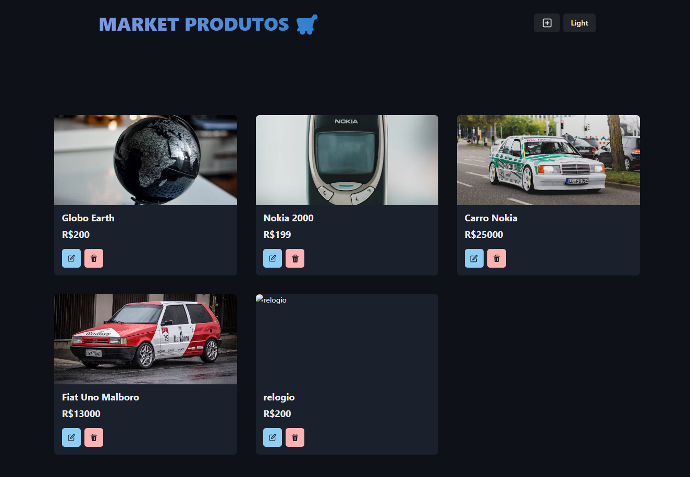
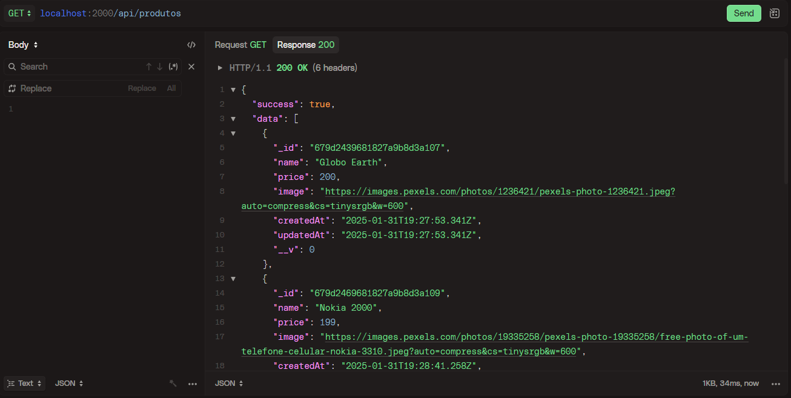
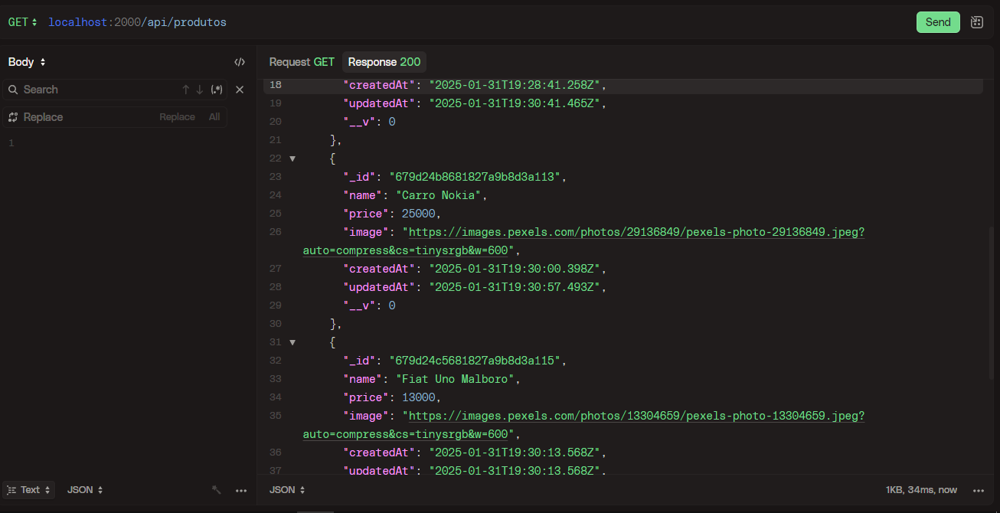
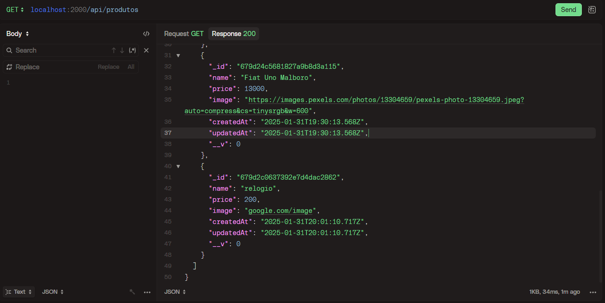
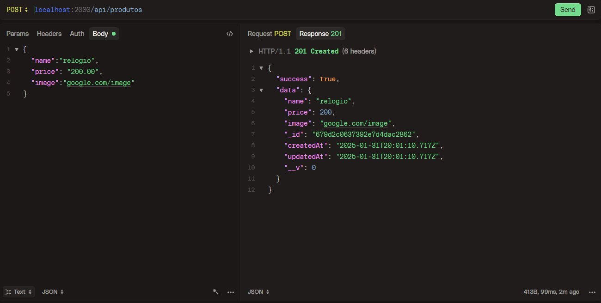
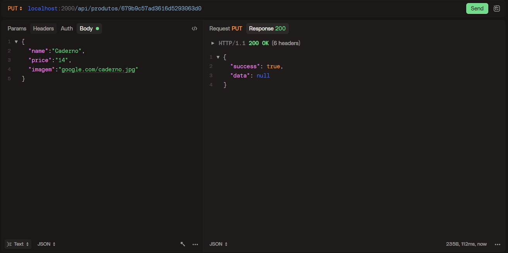
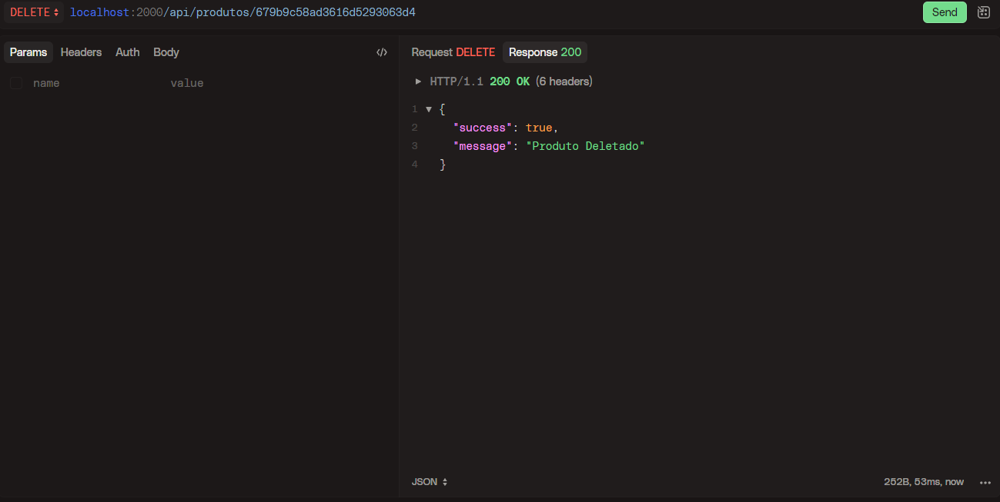

# Sistema de Gerenciamento de Itens

Este projeto é um sistema completo de gerenciamento de produtos, desenvolvido com **Node.js** e **Express** no backend, e um frontend construído com **React**. Ele oferece uma API RESTful com endpoints para operações CRUD (Create, Read, Update, Delete) de produtos, além de uma interface gráfica para interação com o sistema.

---
# Acesse o link do Deploy

[https://marketitens.onrender.com/](https://marketitens.onrender.com/)

## Índice

- [Tecnologias Utilizadas](#tecnologias-utilizadas)
- [Instalação e Execução](#instalação-e-execução)
- [Endpoints da API](#endpoints-da-api)
- [Estrutura do Projeto](#estrutura-do-projeto)
- [Contribuição](#contribuição)
- [Licença](#licença)
- [Contato](#contato)

---
## Screenshots










## Tecnologias Utilizadas

### Backend
- **Node.js**: Ambiente de execução JavaScript.
- **Express**: Framework para construção da API RESTful.

### Frontend
- **Vite**: Ferramenta de build rápida para desenvolvimento moderno.
- **React**: Biblioteca para construção da interface do usuário.
- **Zustand**: Gerenciamento de estado global.
- **Chakra-UI**: Biblioteca de componentes UI para estilização.

### Banco de Dados
- **MongoDB**: Banco de dados NoSQL para armazenamento de dados.

---

## Instalação e Execução

Siga os passos abaixo para configurar e executar o projeto localmente.

### 1. Clone o repositório

```bash
git clone https://github.com/Guisandroni/market-Itens.git
```

### 2. Navegue até o diretório do projeto

```bash
cd market-Itens
```

### 3. Instale as dependências do backend e frontend

No diretório raiz do projeto, instale as dependências do backend:

```bash
npm install
```

Em seguida, execute um único comando, irá instalar as dependências do backend e frontend:

```bash
npm run start
```

Caso queira executar a build para deploy

```bash
npm run build
```
### 4.  Acesse o servidor

O servidor estará disponível em:  
[http://localhost:2000](http://localhost:2000)

---
## Estrutura do Projeto

```
market-Itens/
├── backend/               # Código do backend (Node.js + Express)
│   ├── controllers/       # Lógica dos endpoints
│   ├── routes/            # Definição das rotas
│   ├── models/            # Modelos de dados (MongoDB)
│   | 
│   └── server.js          # Configuração do express e dotenv
│
├── frontend/              # Código do frontend (Vite + React)
│   ├── src/               # Código-fonte do frontend
│   │   ├── components/    # Componentes React
│   │   ├── pages/         # Páginas da aplicação
│   │   ├── store/         # Chamadas à API (Zustand)
│   │   └── App.jsx        # Componente principal
│   └── vite.config.js     # Configuração do Vite
│
├── README.md              # Documentação do projeto
└── package.json           # Dependências e scripts do projeto
```

---

## Licença

Este projeto está licenciado sob a **Licença MIT**. Para mais detalhes, consulte o arquivo [LICENSE](LICENSE).

---

## Contato

Se você tiver dúvidas, sugestões ou quiser entrar em contato, sinta-se à vontade para me encontrar em:

- **GitHub:** [Guisandroni](https://github.com/Guisandroni)
- **Email:**  gui.sandroni@gmail.com
- **LinkedIn:** [Guisandroni](https://www.linkedin.com/in/guisandroni)
